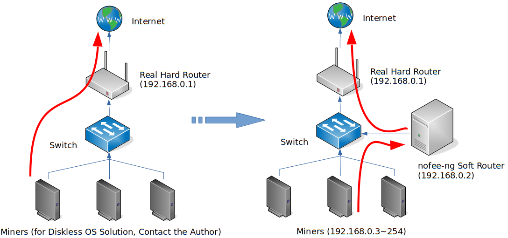

nofee-ng: The Next Generation NoDevFee Mining Software for Cryptocurrency
===

### The first edition you can find on this planet that has the feature of anti-DevFee in a central mode for both GPU miners and hardware miners (FPGA, ASIC, etc). ###

`nofee-ng` is a generic solution for NoDevFee mining. By saying **generic**, we mean that `nofee-ng` can be used to get stolen cryptocurrency back from mining software (which is known as DevFee and is about 0.5~2% of your total mining shares) for many kinds, such as ETH, ETC, XMR, ZCash, etc, by redirecting DevFee to **ANOTHER wallet address** which can be different from the main mining address.

This is the **Next Generation** of NoDevFee program. It works as a "soft router" rather than the first generation which works on a single same machine together with the mining software. So, `nofee-ng` works for both Windows and Linux miner. And it's perfect for mining farms for easy management. If you're a mining farm operator, you can also redirect the DevFee to your own wallet without the knowledge of your tenants! Remember: you are **NOT** stealing from your clients because DevFee belonged to the mining software author.

### The redirected DevFee you get back will show up in a mining pool in about 1~2 hours. Please be patient! ###

The redirected pool which depends on the mining software may be a different mining pool than your main pool, please check the README.md in different folders.

### Make sure you change the wallet address in `nofee.txt` and use **PLAIN** mining protocol. **DO NOT** use encrypted mining protocols such as SSL stratum. ###

The mechanism of `nofee-ng` is depicted in the following graph: The original network traffic, e.g. mining work submission, goes from miners directly to the pool. But now the traffic is redirected to the `nofee-ng` soft router who will change the DevFee wallet to your own wallet address.

## Usage ##

1. Set up a Linux machine which runs `nofee-ng` as a soft router. `nofee-ng` is tested on Debian 9 (Stretch) and CentOS 8, but should work on other Linux distros. The gateway of this soft router should point to the *real hard router*, say 192.168.0.1 in the previous diagram.
2. Download the `nofee-ng` bundle from the corresponding directory for your cryptocurrency and put it on the Linux soft router.
3. Change the wallet address in `nofee.txt`. This file holds the wallet address to which the DevFee will be redirected. The recommended path of `nofee.txt` is `/opt/nofee-ng/nofee.txt`. If not, you **MUST** change the `WorkingDirctory` property in `nofee.service` to the directory which contains `nofee.txt` in the next step.
4. You must login as root or use sudo to execute the following commands on the Linux soft router:
 + `systemctl stop firewalld` (Skip this if you are not running a firewall)
 + `systemctl disable firewalld` (Skip this if you are not running a firewall)
 + Disable SELinux: Change the line containing `SELINUX=` in file `/etc/selinux/config` to `SELINUX=disabled`. And reboot the `nofee-ng` soft router (Skip this if you are not using SELinux)
 + `ln -s /opt/nofee-ng/nofee.service /etc/systemd/system/`
 + `systemctl enable nofee`
 + `systemctl start nofee`
5. Now use `systemctl status nofee` to check whether you can see something like `Active: active (running)` in the heading lines and `Found NoFee Wallet` in the tailing lines. If so, congratulations, `nofee-ng` is configured properly and running. It will be auto started by systemd on next reboot. Otherwise check the error message and Google it or leave me a message.
6. What you need to do right now is to change the default gateway for all your miners to let them point to the *nofee-ng soft router*, say 192.168.0.2 in the previous diagram. You can do this on the DHCP server, e.g. the *real hard router*. Don't be afraid that traffic other than stratum will not work, `nofee-ng` won't touch them.
7. Now let your miners work as usual. After about 1~2 hours, the stolen DevFee will show up in the mining pool as a new miner. The pool and miner's name depend on the mining software. For example, it may be *eth1.0* for ETH. Please check the specific directory for detail.

## Looking for test first? ##

There are two ways to test whether `nofee-ng` works for your miner softwares:

1. Just change the gateway address of one miner to the `nofee-ng` soft router instead all of them and see the result. This is the recommended way.
2. If you don't want to set up the soft router, deploy `nofee-ng` on the same machine with you Linux miner, and change the `ExecStart=` in `nofee.service` to something like `/opt/nofee-ng/nofee_eth -rs`. The `-rs` argument means `nofee-ng` is running in standalone mode. I'm sorry standalone mode doesn't work for Windows miners because it must be in the same machine of the miner software.

## Caution ##

1. Don't forget to change the wallet address in `nofee.txt`
2. Don't use encrypted mining protocol like SSL
3. Don't kill nofee process with `kill -9`. If you want to stop it, use `systemctl stop nofee`

*A little advertisement*: I have a pratical diskless OS mining solution which can reduce the maintenance and cost both for mining farms and miner owners. Any time you have requirements or interest to build such a diskless OS, just contact me on Github.

